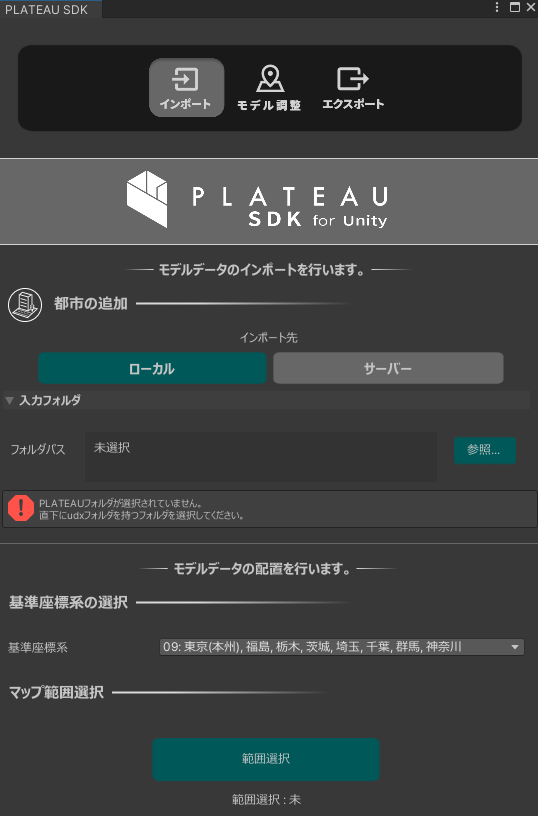
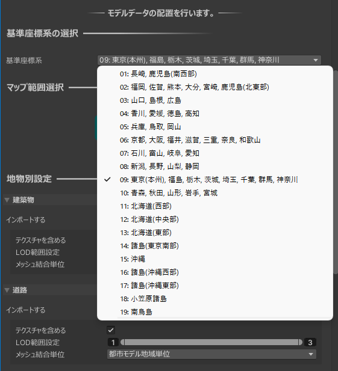
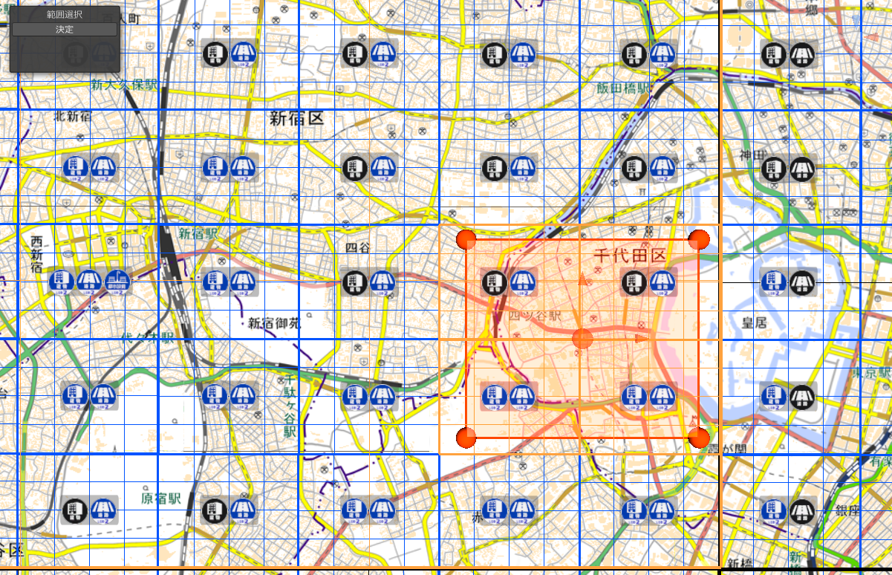
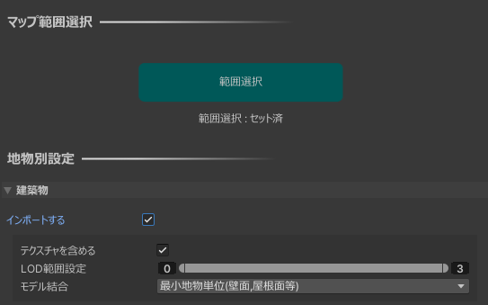
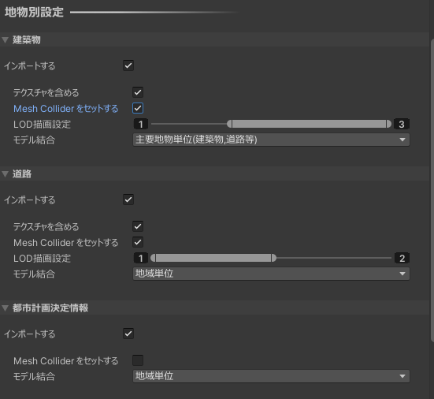
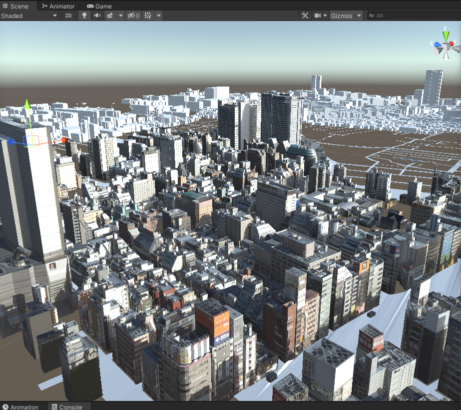

# 都市モデルのインポート

このページでは、都市データをUnityプロジェクトにインポートする手順を説明します。

## 準備
- PlateauSDK を導入したUnityプロジェクトを用意します。  
  SDKの導入方法は [インストール](Installation.md) を参照してください。

## インポート手順
### インポート元の選択
- Unityのメニューバーから ```PLATEAU → PLATEAU SDK``` を選択します。   
  表示されるウィンドウの上部に3つのタブ「インポート、モデル調整、エクスポート」があります。  
  このうちインポートを選択します。

- インポート先でローカル~~またはサーバー~~を選択します。  
  (**Coming Soon**: サーバーからのデータ取得は未実装です。)
  - 導入したい都市データが自分のコンピュータにある場合はローカルを選択します。  
    3D都市モデルは [G空間情報センターのPLATEAUポータルサイト](https://www.geospatial.jp/ckan/dataset/plateau) からダウンロードできます。
    - ```参照```ボタンを押します。都市データのフォルダの選択画面が表示されます。
    - 都市データのフォルダの中には、```udx```,```codelists```という名前のフォルダがあるはずです。  
      ```udx```の**1つ上**のフォルダを選択します。
  - ```サーバー```では、ローカルの代わりにPLATEAUのデータサーバーから都市データをインポートできます。
    - この機能は未実装です。

### 基準座標系の選択
リストのうち、都市が属する場所として近いものを選択します。  
   
適切なものを選ぶと座標の誤差が小さくなります。  
ここで選択する座標系は国土交通省が定める平面直角座標系に準拠しています。  
詳しくは [国土地理院のWebサイト「わかりやすい平面直角座標系」](https://www.gsi.go.jp/sokuchikijun/jpc.html) をご覧ください。

### インポート範囲の選択
- ```範囲選択```ボタンを押します。
- 現在のUnityシーンに変更がある場合、変更を保存するかどうかを尋ねるダイアログが表示されます。  
  ```Save``` または ```Don't Save``` をクリックします。

- シーンビューの表示が切り替わり、範囲選択画面になります。
  
- 範囲選択画面の操作方法：
  - マウスホイールを上下に回してズームアウト、ズームインします。
  - マウスホイールを押し込んだままドラッグしてカメラ移動します。
  - オレンジ色の球体をドラッグして範囲を選択します。
  - シーンビュー左上の```決定```ボタンを押して範囲を確定します。すると元のシーンに戻ります。
- 画面のみかた：
  - 青色の線は利用可能な地域を示します。
  - 地域ごとに利用可能なGML種別と対応LODがアイコン形式で表示されます。
  - 地図は国土地理院のサイトから自動でダウンロードされて表示されます。インターネットへの接続が必要です。
- 範囲選択が完了すると、```範囲選択``` ボタンの下に ```範囲選択:セット済``` という表示がなされ、  
  その下に```地物別設定``` が表示されるようになります。  

- **補足**:  
  地域の区分を確認したい時は、ローカルにダウンロードしたフォルダに付属している ```indexmap``` という名前のpdfファイルをご覧ください。  
下図のように地図上に区分が記載されています。
  

### 地物別設定
地物の種類ごとにインポートに関する設定を行います。  
  
**設定項目について:**
- ```インポートする```
  - チェックが付いている地物タイプのみインポートします。
- ```Mesh Collider をセットする```
  - チェックが付いている場合、各モデルに Mesh Collider が追加されます。
- ```テクスチャを含める```
  - テクスチャが存在する地物タイプで表示される設定項目です。  
    チェックが付いていて、かつテクスチャがある場合はそれを含めてインポートします。  
    都市データによってはテクスチャがない場合があり、  
    その場合はチェックを外した時と同様に真っ白な3Dモデルが出力されます。
- ```LOD描画設定```
  - 複数のLODを利用可能な地物タイプで表示される設定項目です。  
    バーの左端と右端をドラッグして、インポートするLODの範囲を指定できます。

>[!NOTE]
> **LODとは**  
> gmlファイルの中には、都市モデルの形状の細かさを指定したいという需要に対応するため、  
> 複数の形状データが格納されている場合があります。  
> LOD0がもっとも大雑把な形状で、LOD1, LOD2 と数字が上がるほど細かい形状になります。  
> 建築物の場合、LOD0 は平面、LOD1は平面に一定の高さを付けたもの、LOD2はより細かい形状です。

- ```モデル結合```
  - ```主要地物単位（建築物,道路等）```
    - モデルのメッシュは建物ごとに結合されて出力されます。
    - 建物ごとに地物データを取得できるようにしたい場合はこちらを選択します。
  - ```最小地物単位（壁面,屋根面等）```
    - 屋根、壁単位など非常に細かくオブジェクトを分けたい場合はこちらを選択します。
  - ```地域単位```
    - モデルのメッシュは結合されて出力されます。
    - オブジェクト数を削減して軽量化できますが、建物ごとの地物データは取得不可になります。
    - メッシュの結合はある程度の大きさの範囲ごとに行われます。

>[!NOTE]
> **地物の選択について**  
> 地物の中にはインポートに時間がかかるものもあるのでご注意ください。  
> 例えば 土地起伏 はデータの範囲が 10km × 10km と非常に広く、  
> データ容量が重く処理に時間がかかるのでご注意ください。
  
### インポートの実行
- ```モデルをインポート```ボタンを押します。
- ウィンドウを下にスクロールすると、インポート処理の進捗が表示されます。

- 処理が進むと、都市のオブジェクトが順次シーンに配置されていきます。  
  進捗表示がすべて「完了」になったらインポート終了です。  


>[!NOTE]
>   インポート元となる都市データは ```Assets/StreamingAssets/.PLATEAU``` にコピーされます。  
>   .PLATEAU は隠しフォルダである点にご注意ください。Unityのインポート処理を削減する目的でこうなっています。
>   なお、インポート対象として選択したものに関連するもののみがコピーされます。

配置されたゲームオブジェクト階層のトップには、コンポーネント`PLATEAUInstancedCityModel` がアタッチされます。  
このインスペクタから緯度、経度などの情報を確認できます。  


### エラーログの確認

インポートの結果、計算状況ウィンドウの内容がすべて「完了」となれば良いですが、  
ロードできなかったgmlファイルに関しては「失敗」と表示されます。  
そのような場合でも、一部のgmlファイルのロードが成功していれば、そのgmlに関しては正常にインポートされています。  
失敗の場合は Unityのコンソールにエラーログが出力されます。